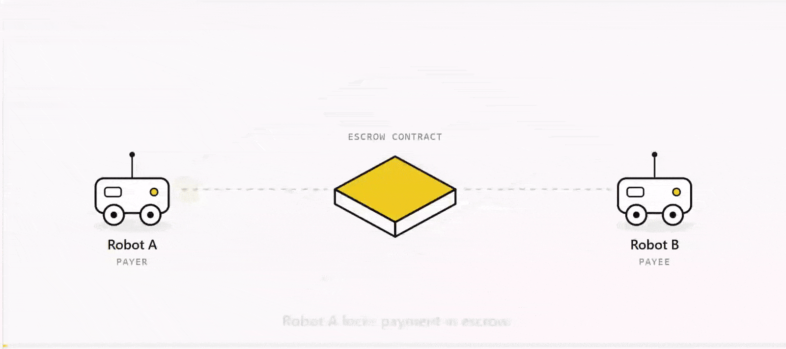

# robopay

**A ROS 2 package for payments between robots.**

[]()
[]()
[]()

robopay gives a robot a wallet and the ability to pay, invoice, and escrow
funds with other robots, through ordinary ROS 2 services, actions, and topics.
Payments settle in USDC on Base.

> Early release. The interfaces work and have been exercised end to end on
> mainnet with real funds, but they may still change. Not production-ready.

<p align="center">
  
</p>

## Why

As robots start entering the economy and become independant economic actors,
they will start to have the need to pay each other. A delivery robot buys a ride
from an autonomous van. A drone pays a charging pad for power. A rover buys a
localisation fix from a neighbour that has already mapped the area.

Two main problems sit in the way, for how they transact between each other.

The first is **settlement**. Robots operate continuously, across owners and
borders, in amounts far too small for card rails or invoices. Stablecoins fit
that shape: programmatic, final in seconds, fractions of a cent in fees, no
account to open.

The second is **trust**. When two robots belong to different owners, neither
has reason to believe the other will hold up its end. The payer does not want
to pay before the service is rendered; the payee does not want to work before
being sure of payment. robopay's escrow partially resolves that standoff: funds lock in a
public contract and release only when both parties cryptographically agree the
job was done, or return to the payer automatically if it was not.

## What it does

**Wallets.** Each robot holds its own keys, encrypted at rest. Keys never cross
the ROS graph: services take addresses, and signing happens inside the node.

**Payments.** Send USDC with one service call. Transfers survive network drops
and process restarts. Every payment carries an idempotency key, lifecycle state
is written to disk before broadcast, and a background resolver reconciles
anything interrupted against the chain. A dropped connection mid-payment cannot
cause a double-spend.

**Escrow.** Lock funds against agreed terms, release them when both parties
sign (EIP-712), or refund automatically when a deadline passes. All parties use
one shared, verified contract.

**Condition-triggered payments.** Bind a payment to any condition your code can
evaluate, including sensor state. The package ships the primitives that make
repeated triggering safe: edge detection so a condition that stays true does
not fire sixty payments, rate limits, debouncing, and cooldowns.

**Spending caps.** Per-transaction and rolling-window limits, on by default,
enforced at the signing chokepoint. A bug or a runaway trigger costs the cap,
not the balance.

## Who it's for

Robotics developers and researchers who want to experiment with machine-to-machine
payments without first becoming blockchain engineers. If you can write a ROS 2
node, you have everything you need. The package handles keys, gas, nonces,
signing, and chain interaction.

## Install

Requires ROS 2 (Humble or Jazzy) and Python 3.10+.

```bash
git clone https://github.com/OpenRobotEconomy/robopay.git
cd robopay

pip install web3 eth-account cryptography python-dotenv typer rich qrcode

colcon build
source install/setup.bash
```

## Quickstart

Create a wallet. You will be asked for a passphrase; it encrypts the private
key on disk and cannot be recovered if lost.

```bash
ros2 run robopay_core robopay wallet create --label my-robot
```

Fund it. On testnet the faucets are free; the command prints a QR code and
waits for the money to arrive.

```bash
ros2 run robopay_core robopay fund <your-address>
```

Start the payment node.

```bash
ros2 run robopay_core payment_node --ros-args \
  -p backend:=self_custody -p chain:=base-sepolia
```

Now make a robot pay when a condition becomes true. The example below watches a
`std_msgs/Bool` topic and sends USDC the moment it goes true.

```bash
ros2 run robopay_examples pay_on_condition --ros-args \
  -p from_address:="'<your-address>'" \
  -p to_address:="'<their-address>'" \
  -p amount:="'0.01'"
```

Trigger it:

```bash
ros2 topic pub --once /delivery_confirmed std_msgs/Bool "{data: true}"
```

That is a robot paying another robot, assuming the physical world changed.

### Running on mainnet

Everything above works the same on Base mainnet. Add `--chain base` to the CLI
commands and `-p chain:=base` to the node, and set spending caps appropriate to
real money:

```bash
ros2 run robopay_core robopay balance <your-address> --chain base

ros2 run robopay_core payment_node --ros-args \
  -p backend:=self_custody -p chain:=base \
  -p max_per_transaction:="'0.10'" -p max_per_window:="'0.50'"
```

There are no faucets on mainnet: send real USDC and a small amount of ETH for
gas to the wallet address.

## Using it in your own node

Payments are a service call:

```python
from robopay_interfaces.srv import Transfer

request = Transfer.Request()
request.from_address = self.my_address
request.to_address = payee
request.amount = "0.05"
request.asset = "USDC"
self.pay_client.call_async(request)
```

Escrow has a small client:

```python
from robopay_core.client import EscrowClient

escrow = EscrowClient(self)                 # `self` is your Node

task = escrow.open(payer=me, payee=them, amount="2.50",
                   timeout_seconds=600, on_done=self._finished)

# later, once the service has been rendered:
escrow.sign(task.escrow_id, role="payer")
```

And the safety primitives are importable on their own:

```python
from robopay_core.triggers import EdgeTrigger, RateLimit

self.trigger = EdgeTrigger()                # fire once per rising edge
self.limit = RateLimit(max_events=5, window_seconds=60)

def on_condition(self, msg):
    if self.trigger.fired(msg.data) and self.limit.allow():
        self.pay(...)
```

## Interfaces

| | |
| --- | --- |
| `wallet/create`, `wallet/balance` | create and inspect wallets |
| `transfer/preview` | free dry run: would this payment succeed? |
| `transfer/send` | send USDC |
| `escrow` *(action)* | open, wait, release or refund |
| `escrow/sign`, `escrow/submit_signature` | produce and collect release signatures |
| `/escrow/signatures`, `/payment_requests` | peer exchange on a shared network |

## How it fits together

`payment_node` holds the wallet, signs internally, and exposes everything else
over ROS. Underneath it, a pluggable backend talks to the chain, so the same
robot code runs against an in-memory mock, a testnet, or mainnet.

The escrow contract is deployed once and shared:

- **Base mainnet** [`0x7c41381C461AA546B8953d35d5bF61321AA251Ed`](https://basescan.org/address/0x7c41381C461AA546B8953d35d5bF61321AA251Ed)
- **Base Sepolia** [`0x11860A5EAF6DF1E95e34B07628C4924Ef127d9C9`](https://sepolia.basescan.org/address/0x11860A5EAF6DF1E95e34B07628C4924Ef127d9C9)

Both are verified; the source is readable on Basescan.

Built on [Base](https://base.org) and [USDC](https://www.circle.com/usdc).

## Scope

Some things sit outside the package, because they depend on hardware and
deployment rather than on payments.

**Discovery and transport.** How two robots first learn each other's address,
whether by NFC tap, QR code, or a fleet dispatcher, is yours to choose. robopay
works from whatever handle that produces. For robots on a shared ROS network,
the package ships topic-based exchange as a convenience.

**Proof of physical delivery.** An escrow releases when both parties sign. What
convinces a robot to sign, whether a load cell reading, an RFID scan, or a
camera frame, comes from your own sensing stack. robopay provides the
cryptographic side of that exchange.

## Docs

More documentation, guides, and the protocol specification:
**[openroboteconomy.org](https://openroboteconomy.org)**

## License

MIT.
